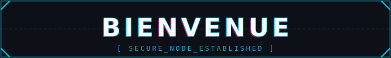

<div align="center">
  

  <br /> <br />

  

  <h1 style="color: #00d8ff; font-family: monospace;">DUNKY</h1>
  
  <p>
    <a href="https://www.linkedin.com/in/duncan-l-3b5551252/" target="_blank">
      
    </a>
    <a href="https://github.com/DuunKy" target="_blank">
      
    </a>
  </p>
</div>

<br />

<h3 align="center">📟 Terminal Session_</h3>

```bash
user@dunky-lab:~$ ./status_check.sh

> IDENTITY......: DunKy
> CLASS.........: DevSecOps Cloud AI
> LOCATION......: Encrypted Node [France]
> CURRENT_TASK..: Securing Cloud Infrastructures & Training Neural Nets
> MOOD..........: ☕ Tea && 🔒 Zero Trust
```
---

<h3 align="center">📡 MISSION PROFILE -- EXPERTISE</h3>

> **System Analysis:** `Management` `Coordination` `Adaptability` `Analysis`

<div align="center">

| **🛡️ GOUVERNANCE & SÉCURITÉ** | **☁️ INFRA & VIRTUALISATION** | **💻 ADMIN SYSTÈME** |
| :--- | :--- | :--- |
| • Sécurité Systèmes & Réseaux<br>• Conformité RGPD & Normes ISO<br>• Gestion des risques | • Cloud Architecture (Azure/AWS)<br>• VMware & VirtualBox<br>• Conteneurisation (Docker/K8s) | • Windows Server (2016-2022)<br>• Linux (RedHat, Rocky, Debian, Kali)<br>• Maintenance & Monitoring |

</div>

<br/>

<h3 align="center">🛠️ ARSENAL</h3>

<div align="center">

| **01 // CLOUD & VIRTUALIZATION** |
| :---: |
|       |

| **02 // SYSTEM & NETWORK** |
| :---: |
|       |

| **03 // PROGRAMMING & SCRIPTING** |
| :---: |
|       |

| **04 // WEB & TOOLS** |
| :---: |
|      |

</div>

<div align="center">
  <code>End of Transmission_ // Connection Closed.</code>
</div>

</div>
